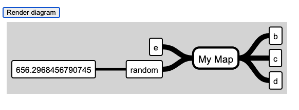

# Diagram Codes Engine Client Integration Library

This repository contains the client library for embedding the
Diagram Codes Engine into a Web Application.

**An active integration subscription is required for using this library in production.**


## Install

yarn add diagram-codes-engine-client

## Usage

Import the module:

```
import diagramEngine from 'diagram-codes-engine-client'
```

Then, set the path to the engine. This is provided to you when registering
for an integration subscription.

For test purposes you can use this path: https://web-engine-demo-dev.diagram.codes/apirender/


With an active integration subscription you will receive a custom URL for the render-engine (or the web assets to deploy it on any hosting). 


```javascript
//Use your unique engine url.
diagramEngine.setEnginePath('https://web-engine-demo-dev.diagram.codes/apirender/')
```

```javascript
let diagramParams = {
    container:'#container',
    type:'mind-map',
    code:`
        "My Map"->b,c,d,e,random
        random->${Math.random()*1000}
    `
}
```



The previous code will initialize the container and will render
the provided diagram (in this case a mind map).


## Setting themes

Appearance can be modified to better fit with the host application styles.

```javascript
let diagramParams = {
    container:'#container',
    type:'mind-map',
    code:'a->b,c,d,e',
    theme: {
        document: {
            backgroundColor: "#fff",
            shadowColor: "black",
            shadow: false,
        },
        nodes: {
            fontFamily: "Arial",
            fontSize: "16",
            textColor:'black',
            fillColor: "white",
            borderWidth: "2",
            borderColor: "black",
            borderRadius: 3,
            padding: 8,
        },
        labels: {
            fontFamily: "Arial",
            fontSize: "14",
            textColor:'black',
            fillColor: "white",
            borderWidth: "0",
            borderColor: "none",
            borderRadius: 0,
            padding: 4,
        },
        connectors: {
            color: "black",
            width: "2",
        }
    }
}

```

## Events

### Capture errors

Add a global error handler:

```
    DiagramEngine.setErrorHandler((errorData)=>{
        console.log(errorData.message);
        console.log(errorData.line);
    })
```


